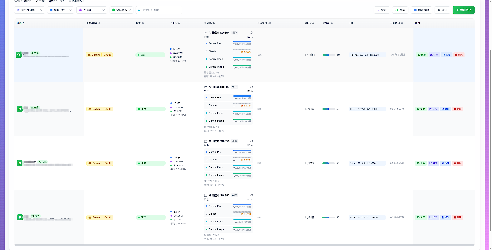

# Claude Relay Service (Antigravity Edition)

> **二开维护：dadongwo**
>
> 目标：让 `claude`（Claude Code CLI）与 Antigravity / Gemini 账户体系无缝对接，并提供可观测、可运维的稳定转发服务。

<div align="center">

[](https://opensource.org/licenses/MIT)
[](https://nodejs.org/)
[](https://www.docker.com/)
[](https://github.com/dadongwo)
[](https://github.com/dadongwo/claude-relay-service)

**🔐 Claude Code 原生适配 · Antigravity 生态 · 多账户管理 · OpenAI 格式兼容**

</div>

---

## 🌟 核心亮点

这是一个二开项目：在原版 CRS 基础上补齐 Claude Code 协议层兼容、完善 Antigravity OAuth 与路径分流，并增强稳定性与可观测性。

### 1. 🚀 Claude Code 原生级兼容 (Killer Feature)
无需任何魔法，让你的 `claude` 命令行工具像连接官方一样连接到本服务。

- **Thinking Signature 伪造/缓存/恢复**：解决 Claude Code 3.7+ 对 `thoughtSignature` 的强校验，支持兜底签名策略与签名缓存。
- **Tool Result 透传**：兼容 Base64 图片等复杂结构，避免转发丢失/格式错误。
- **消息并发治理**：拆分 Claude Code 混合发送的 `tool_result + user_text`，按协议顺序转发。
- **僵尸流看门狗**：SSE 连接 45 秒无有效数据自动断开，避免"假活着"导致会话/额度被占用。

### 2. 🛡️ Antigravity & Gemini 深度集成
- **Antigravity OAuth 支持**：新增 `gemini-antigravity` 账户类型，支持 OAuth 授权与权限校验。
- **路径即路由 (Path-Based Routing)**:
  - `/antigravity/api` -> 自动路由到 Antigravity 账户池
  - `/gemini-cli/api` -> 自动路由到 Gemini 账户池
  - 告别在模型名前加前缀（如 `gemini/claude-3-5`）的混乱做法，Client 端只需改 Base URL 即可。
- **额度与模型动态列表适配**：针对 Antigravity 的 `fetchAvailableModels` 做标准化展示（管理后台）与透传（接口）。
- **OpenCode & Oh My OpenCode 原生支持**：完美兼容 Antigravity 账户体系下的 OpenCode 配置，支持通过 `gemini-antigravity` 账户直接驱动 OpenCode 插件。

### 3. ⚙️ 企业级稳定性
- **智能风控对齐**：自动注入 `requestType: 'agent'` 并优化 System Prompt 插入策略，降低被上游风控拦截的概率。
- **智能重试与切换账号**：针对 Antigravity `429 Resource Exhausted` 深度解析（区分 Quota/RateLimit/Capacity），自动清理会话并切换账号重试。
- **模型级智能冷却**：支持对 Claude/Opus/Flash 等不同模型分别计算冷却时间，避免因单一模型限流影响整个账号使用。
  <br/>
- **日志安全与轮转**：避免循环引用导致的进程崩溃，并对 Dump 文件进行大小控制与轮转。
- **调试利器**：支持请求/响应/工具定义/上游请求与上游 SSE 响应的 JSONL 转储，便于复现与定位问题。

### 4. 🔥 流式响应弹性恢复架构 (2026-01 新增)
- **三级降级恢复机制**：当上游异常中断（无 `finishReason`）时自动救援
  - Level 1: 非流式重试 → 提取 tool_use
  - Level 2: 强制工具调用 → 基于 TodoWrite 推断
  - Level 3: 兜底文本注入 → 避免客户端卡死
- **智能限流处理引擎**：精确解析 Google API 延迟指令（`RetryInfo`/`quotaResetDelay`）
- **非流式转流式协议适配器**：内部使用 SSE 流式传输，合并分片响应，10 分钟超时兜底

### 5. 🛠️ MCP 工具兼容性增强 (2026-01 新增)
- **浏览器工具调用稳定性**：加强 `browser_*` 系列工具兼容
- **工具输出语义压缩引擎**：智能压缩大体积工具输出（浏览器快照、大文件提示等）
- **工具输入规范化处理**：自动修复上游返回的非标准 args 格式

### 6. 🌐 OpenAI 格式兼容 (多路由支持)
支持使用 OpenAI `/v1/chat/completions` 格式调用后端模型，方便第三方客户端接入。

| 路由 | 说明 |
|------|------|
| `/openai/gemini/v1/chat/completions` | OpenAI 格式 → Gemini/Antigravity 账户池 |
| `/openai/claude/v1/chat/completions` | OpenAI 格式 → Claude 账户池 |
| `/openai/v1/chat/completions` | OpenAI 格式 → OpenAI 账户池 |

**特性**：
- 自动格式转换（messages ↔ contents）
- 流式/非流式均支持
- 支持 Antigravity 账户（自动路由到 `gemini-antigravity`）

---

## 📊 额度与模型查询 (Antigravity 专属)

### 查看账户额度 / Quota
本服务深度适配了 Antigravity 的实时配额查询接口 (v1internal:fetchAvailableModels)。

1. 进入管理后台 -> **账号管理 (Claude 账户)**。
2. 找到您的 `gemini-antigravity` 类型账户。
3. 点击卡片右上角的 **"测试/刷新"** 按钮。
4. 系统会自动拉取上游最新的配额信息（支持 Gemini Pro / Flash / Image 等不同分类），并将其标准化展示为百分比与重置时间。
   > **Note**: 若某个模型触发了限流，此处还会显示该模型的 **冷却倒计时 (Cooling Down)**，方便您了解何时可以恢复使用。

### 获取动态模型列表
由于 Antigravity 的模型 ID 是动态更新的（如 `gemini-2.0-flash-exp`），本服务提供了透传查询接口。

- **接口地址（Anthropic/Claude Code 路由）**: `GET /antigravity/api/v1/models`
- **接口地址（OpenAI 兼容路由）**: `GET /openai/gemini/models`（或 `GET /openai/gemini/v1/models`）
- **说明**: `/antigravity/api/v1/models` 会实时透传 Antigravity 上游 `fetchAvailableModels` 结果，确保看到当前账户可用的最新模型列表。

---

## 🎮 快速开始指南

### 0. 环境要求
- Node.js 18+（或使用 Docker）
- Redis 6+/7+

### 1. Claude Code (CLI) 配置

无需修改代码，只需设置环境变量即可无缝切换后端。

#### 方案 A: 使用 Antigravity 账户池 (推荐)
适用于通过 Antigravity 渠道使用 Claude 模型 (如 `claude-opus-4-5` 等)。

```bash
# 1. 设置 Base URL 为 Antigravity 专用路径
export ANTHROPIC_BASE_URL="http://你的服务器IP:3000/antigravity/api/"

# 2. 设置 API Key (在后台创建，权限需包含 'all' 或 'gemini')
export ANTHROPIC_AUTH_TOKEN="cr_xxxxxxxxxxxx"

# 3. 指定模型名称 (直接使用短名，无需前缀！)
export ANTHROPIC_MODEL="claude-opus-4-5"

# 4. 启动
claude
```

#### 方案 B: 使用 Gemini 账户池 (Gemini Models)
适用于直接调用 Google Gemini 模型 (如 `gemini-2.5-pro`)。

```bash
export ANTHROPIC_BASE_URL="http://你的服务器IP:3000/gemini-cli/api/"
export ANTHROPIC_AUTH_TOKEN="cr_xxxxxxxxxxxx"
export ANTHROPIC_MODEL="gemini-2.5-pro"
claude
```

#### 方案 C: 标准 Claude 账户池
适用于原版 Claude / Console / Bedrock 渠道。

```bash
export ANTHROPIC_BASE_URL="http://你的服务器IP:3000/api/"
export ANTHROPIC_AUTH_TOKEN="cr_xxxxxxxxxxxx"
claude
```

---

### 4. 🔌 OpenCode 集成配置
 
 在用户目录下的 `.config\opencode\opencode.json` 文件中配置 `provider`：
 
 ```json
 // antigravity 配置示例
 "antigravity": {
   "npm": "@ai-sdk/anthropic",
   "name": "Antigravity",
   "options": {
     "baseURL": "http://localhost:3000/antigravity/api/v1",
     "apiKey": "cr_XXXXXXXXX"
   },
   "models": {
     "claude-opus-4-5-thinking": {
       "name": "Claude Opus 4.5 Thinking",
       "thinking": true,
       "limit": {
         "context": 200000,
         "output": 8192
       },
       "modalities": {
         "input": ["text", "image"],
         "output": ["text"]
       }
     },
     "claude-sonnet-4-5-thinking": {
       "name": "Claude Sonnet 4.5 Thinking",
       "thinking": true,
       "limit": {
         "context": 200000,
         "output": 8192
       },
       "modalities": {
         "input": ["text", "image"],
         "output": ["text"]
       }
     },
     "gemini-3-flash-preview": {
       "name": "Gemini 3 Flash Preview",
       "attachment": true,
       "limit": {
         "context": 1000000,
         "output": 8192
       },
       "modalities": {
         "input": ["text", "image", "pdf"],
         "output": ["text"]
       }
     },
     "gemini-3-pro-preview": {
       "name": "Gemini 3 Pro Preview",
       "thinking": true,
       "attachment": true,
       "limit": {
         "context": 1000000,
         "output": 8192
       },
       "modalities": {
         "input": ["text", "image", "pdf"],
         "output": ["text"]
       }
     }
   }
 },
 
 // codex cli 接入账户示例
 "openai-custom": {
   "npm": "@ai-sdk/openai",
   "name": "OpenAI Custom",
   "options": {
     "baseURL": "http://localhost:3200/openai",
     "apiKey": "cr_xxxxxxxxxxxxxxxx"
   },
   "models": {
     "gpt-5.2": {
       "name": "GPT 5.2 (Custom)",
       "limit": {
         "context": 272000,
         "output": 128000
       },
       "modalities": {
         "input": ["text", "image"],
         "output": ["text"]
       },
       "variants": {
         "none": { "reasoningEffort": "none", "reasoningSummary": "auto", "textVerbosity": "medium" },
         "low": { "reasoningEffort": "low", "reasoningSummary": "auto", "textVerbosity": "medium" },
         "medium": { "reasoningEffort": "medium", "reasoningSummary": "auto", "textVerbosity": "medium" },
         "high": { "reasoningEffort": "high", "reasoningSummary": "detailed", "textVerbosity": "medium" },
         "xhigh": { "reasoningEffort": "xhigh", "reasoningSummary": "detailed", "textVerbosity": "medium" }
       }
     },
     "gpt-5.2-codex": {
       "name": "GPT 5.2 Codex (Custom)",
       "limit": {
         "context": 272000,
         "output": 128000
       },
       "modalities": {
         "input": ["text", "image"],
         "output": ["text"]
       },
       "variants": {
         "low": { "reasoningEffort": "low", "reasoningSummary": "auto", "textVerbosity": "medium" },
         "medium": { "reasoningEffort": "medium", "reasoningSummary": "auto", "textVerbosity": "medium" },
         "high": { "reasoningEffort": "high", "reasoningSummary": "detailed", "textVerbosity": "medium" },
         "xhigh": { "reasoningEffort": "xhigh", "reasoningSummary": "detailed", "textVerbosity": "medium" }
       }
     },
     "gpt-5.1-codex-max": {
       "name": "GPT 5.1 Codex Max (Custom)",
       "limit": {
         "context": 272000,
         "output": 128000
       },
       "modalities": {
         "input": ["text", "image"],
         "output": ["text"]
       },
       "variants": {
         "low": { "reasoningEffort": "low", "reasoningSummary": "detailed", "textVerbosity": "medium" },
         "medium": { "reasoningEffort": "medium", "reasoningSummary": "detailed", "textVerbosity": "medium" },
         "high": { "reasoningEffort": "high", "reasoningSummary": "detailed", "textVerbosity": "medium" },
         "xhigh": { "reasoningEffort": "xhigh", "reasoningSummary": "detailed", "textVerbosity": "medium" }
       }
     }
   }
 }
 ```
 
 #### `oh-my-opencode.json` 配置文件示例:
 
 ```json
 {
   "$schema": "XXXXXXXXX",
   "google_auth": false,
   "agents": {
     "sisyphus": {
       "model": "antigravity/claude-opus-4-5-thinking"
     },
     "oracle": {
       "model": "openai-custom/gpt-5.2"
     },
     "librarian": {
       "model": "opencode/glm-4.7-free"
     },
     "explore": {
       "model": "antigravity/gemini-3-flash-preview"
     },
     "frontend-ui-ux-engineer": {
       "model": "antigravity/gemini-3-pro-preview"
     },
     "document-writer": {
       "model": "antigravity/gemini-3-flash-preview"
     },
     "multimodal-looker": {
       "model": "antigravity/gemini-3-flash-preview"
     }
   }
 }
 ```
 
 ---

支持任何兼容 OpenAI API 的客户端（如 ChatBox、LobeChat、自定义应用等）。

#### 使用 Gemini/Antigravity 后端

```bash
# Base URL
http://你的服务器IP:3000/openai/gemini/v1

# API Key
cr_xxxxxxxxxxxx

# Model
gemini-2.5-pro  # 或 claude-opus-4-5（Antigravity 账户）
```

#### 使用 Claude 后端

```bash
# Base URL
http://你的服务器IP:3000/openai/claude/v1

# API Key
cr_xxxxxxxxxxxx

# Model
claude-3-5-sonnet
```

---

### 3. Gemini CLI 配置

支持通过 Gemini 协议直接访问。

**方式一：通过 Gemini Assist API (推荐)**

```bash
export CODE_ASSIST_ENDPOINT="http://你的服务器IP:3000/gemini"
export GOOGLE_CLOUD_ACCESS_TOKEN="cr_xxxxxxxxxxxx" # 使用 CRS 的 API Key
export GOOGLE_GENAI_USE_GCA="true"
export GEMINI_MODEL="gemini-2.5-pro"
gemini
```

---

## 📦 部署说明

### Docker Compose (推荐)

```bash
# 1. 初始化配置
cp .env.example .env
cp config/config.example.js config/config.js

# 2. 编辑 .env（至少设置这两个）
# JWT_SECRET=...（随机字符串）
# ENCRYPTION_KEY=...（32位随机字符串）

# 3. 启动
docker-compose up -d
```

### Node 方式（不使用 Docker）

```bash
npm install
cp .env.example .env
cp config/config.example.js config/config.js
npm run setup
npm run service:start:daemon
```

### 管理面板

- 地址: `http://IP:3000/web`
- 初始账号/密码：`npm run setup` 生成并写入 `data/init.json`（Docker 部署可通过容器日志定位）。

---

## 🔧 调试与排障（可选）

Dump 开关在 `.env.example` 中有完整说明。常用项：

- `ANTHROPIC_DEBUG_REQUEST_DUMP=true`
- `ANTHROPIC_DEBUG_RESPONSE_DUMP=true`
- `ANTIGRAVITY_DEBUG_UPSTREAM_REQUEST_DUMP=true`
- `ANTIGRAVITY_DEBUG_UPSTREAM_RESPONSE_DUMP=true`
- `DUMP_MAX_FILE_SIZE_BYTES=10485760`

---

## 🤝 维护与致谢

- **维护者**：dadongwo
- **Upstream**：Claude Relay Service（原版项目，已在本分支移除与功能无关的广告信息并专注于功能增强）
